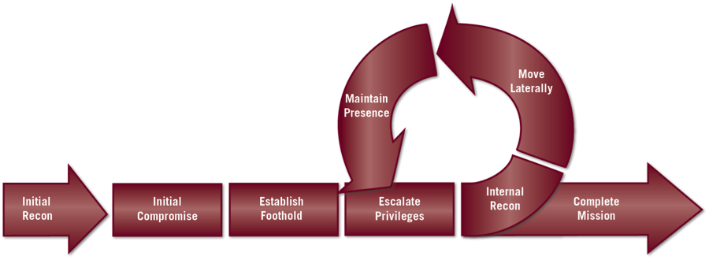

# Red Team Operations Attack Lifecycle

### Initial Reconnaissance
The first step in any attack lifecycle is to gather valuable information on the target. In order to find the most efficient way to attack the target, adversaries perform extensive information gathering on target’s technical and non-technical assets. Data is collected using either active or passive reconnaissance. Active reconnaissance involves any information gathering via techniques that directly interact or communicate with a system belonging to the target organization. Whereas passive reconnaissance involves gathering information using sources the target organization does not own, increasing the difficulty of detecting the reconnaissance activity.

**Valuable Data**
1. Technical
    * DNS Records
    * Username formats
    * Email formats
    * Remote access and login systems used (SSO, federated identity, etc.)
    * Physical access systems used (RFID, etc.)
    * Anti-Virus software used
    * Firwalls
    * Routers
    * Services, software, operating systems, etc. being used
    * Active systems and open ports

2. Nontechnical
    * Important employee names
    * Important employee job titles
    * Major departments withing the organization
    * Geographical locations of each department
    * Patterns within in the organization

**Tools and Techniques**
1. Open-source
    * [EmailHarvester](https://github.com/maldevel/EmailHarvester)
    * [Nmap](https://github.com/nmap/nmap)
    * [Sublist3r](https://github.com/aboul3la/Sublist3r)
    * [Shodan](https://www.shodan.io/)
    * [Dirbuster]()
    * [ARIN whois](https://whois.arin.net/ui/)
2. Commercial
    * [Maltego](https://docs.maltego.com/support/home)
    * [Wireshark](https://www.wireshark.org/)

### Initial Compromise

### Establish Foothold

### Escalate Privileges

### Internal Recon

### Move Laterally

### Maintain Presence

### Complete Mission
